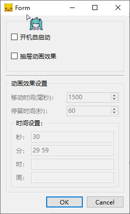

# PopupClock
仿超级小桀的时钟

## 设置说明

周时分秒 四项用来控制时钟的弹出时间

数值范围

> 周 `00 - 06`    `0`代表周日，其他依次类推

> 时 `00 - 23`

> 分 `00 - 59`

> 秒 `00 - 59`

为空时表示全部触发，每个数字使用空格隔开

例：

> 秒: `30`

> 分：`29 59`

> 时：`08 12`

> 周：`00 06`

表示每周六和周日的八点和十二点的29分30秒和59分30秒，时钟弹出
***注意：个位数需要多补一个0，比如0要写成00，  3要写成03！！！！！！！！***

## v1.0.1更新

1. 开机自启动

## v2.0.0更新

1. 添加设置界面
2. 可自定义弹入弹出的时间间隔或者永久停留在桌面
3. 记忆控件在桌面的位置

